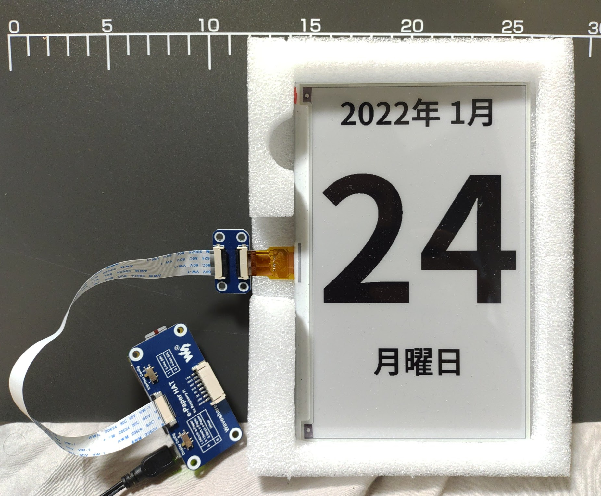
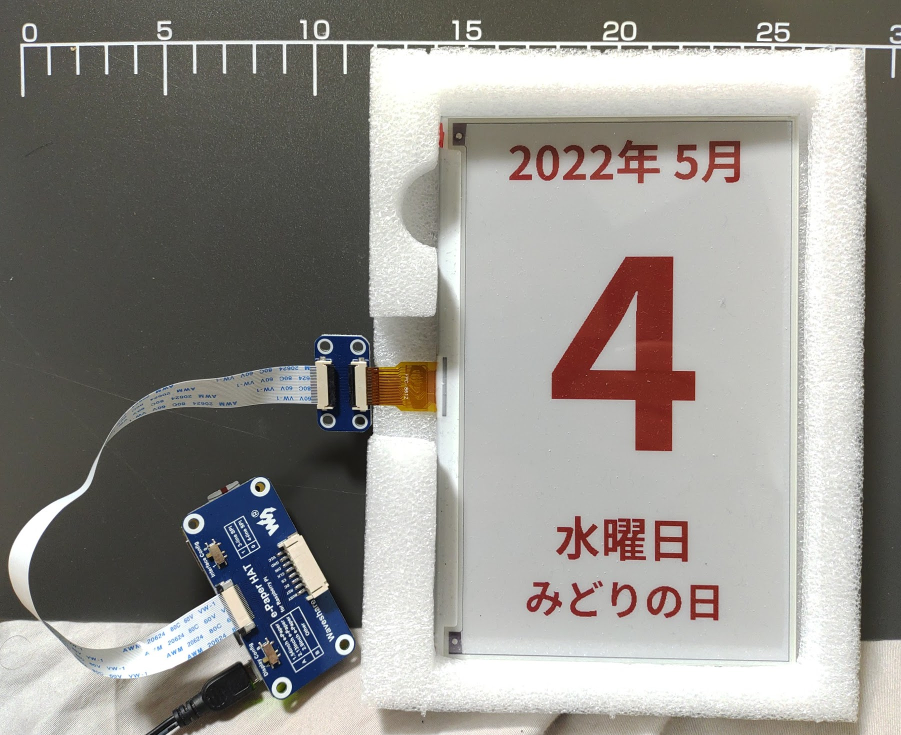

# raspi-epaper-daily-calendar

A project to show a day on epaper with using raspberry pi.




## Components

- [7.5inch epaper module type B 800x480](https://www.waveshare.com/7.5inch-e-paper-hat-b.htm)

Congifugations of switches on the hat.

Name | Value
---- | -----
Display config | A
Interface config | B

## Setup raspberry pi

See [wiki of epaper module 7.5inch_e-Paper_HAT_(B)](https://www.waveshare.com/wiki/7.5inch_e-Paper_HAT_(B)).

Enable SPI by raspi-config.
```sh
sudo raspi-config
# Interfacing Options -> SPI -> YES
```

Setup BCM2835 libraries.
```sh
cd /tmp
wget http://www.airspayce.com/mikem/bcm2835/bcm2835-1.60.tar.gz
tar zxvf bcm2835-1.60.tar.gz
cd bcm2835-1.60/
./configure
make
make check
sudo make install
```

Setup python3
```sh
sudo apt update
sudo apt install -y python3-pip python3-pil python3-numpy python3-spidev
pip3 install RPi.GPIO pytz
```

Setup library of waveshare_epd.
```sh
sudo apt install -y git
mkdir ~/gitprojects
cd ~/gitprojects
git clone https://github.com/waveshare/e-Paper

# change the version of python in the following command if needed
ln -s ~/gitprojects/e-Paper/RaspberryPi_JetsonNano/python/lib/waveshare_epd/ ~/.local/lib/python3.9/site-packages/
```

Setup fonts.
```sh
sudo apt install -y fonts-noto
```

## Run
```sh
python3 src/calendar_7in5b_V2.py
```

## References

- [Raspberry Piでe-Paper（電子ペーパー）を動かして日本語を表示する方法](https://asukiaaa.blogspot.com/2018/04/raspberry-pie-paper.html)
- [国民の祝日: 日本](https://national-holidays.jp/about.html)
- [vourja/japanese-holiday](https://bitbucket.org/vourja/japanese-holiday/src/master/)
- [800×480, 7.5inch E-Ink display HAT for Raspberry Pi](https://www.waveshare.com/product/7.5inch-e-paper-hat.htm)
- [7.5inch e-Paper HAT](https://www.waveshare.com/wiki/7.5inch_e-Paper_HAT)
